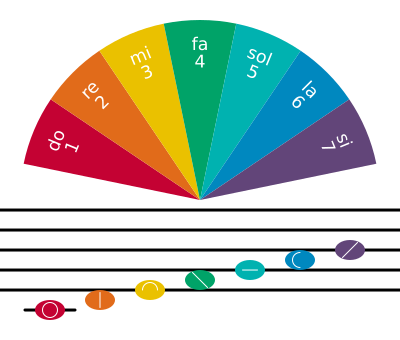
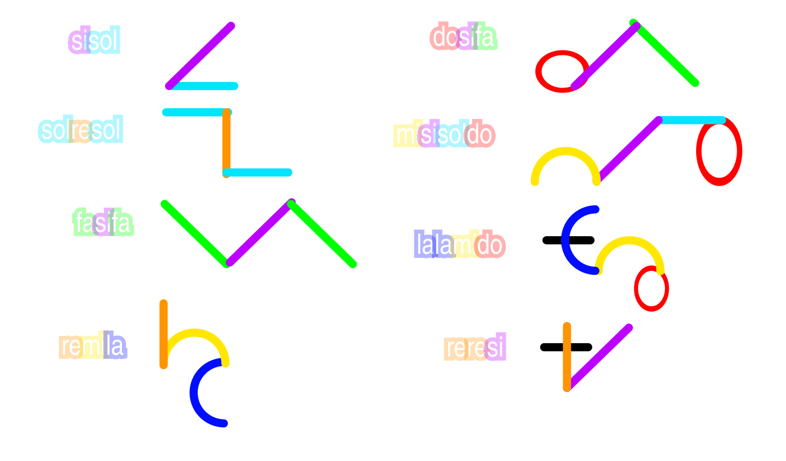

* [Solresol_representations.svg](https://commons.wikimedia.org/wiki/File:media/Solresol_representations.svg) - Five different representations of the constructed language [Solresol](https://en.wikipedia.org/wiki/Solresol): solfège, colours, syllables (morphemes), digits and symbols. Vector version of [File:SolresolFarben ecritures.png](https://commons.wikimedia.org/wiki/File:SolresolFarben_ecritures.png) by [Égoïté](https://commons.wikimedia.org/wiki/User:Égoïté), in turn a derivative (ti to si) of [File:SolresolFarben.png](https://commons.wikimedia.org/wiki/File:SolresolFarben.png) by [Immanuel Giel](https://commons.wikimedia.org/wiki/User:Immanuel_Giel). This version is by [Parcly Taxel](https://en.wikipedia.org/wiki/User:Parcly_Taxel), and is licensed under [Creative Commons](https://en.wikipedia.org/wiki/en:Creative_Commons) [Attribution 4.0 International](https://creativecommons.org/licenses/by/4.0/deed.en) license.

  ---

* [Solresol_words.svg ](https://commons.wikimedia.org/wiki/File:Solresol_words.svg) -
  Some words in Solresol, in both the Latin alphabet and the Solresol script. Based on [Solresol words.gif](https://commons.wikimedia.org/wiki/File:Solresol_words.gif) by 9spaceking, which was based directly on page 19 of [Grammaire du Solresol.pdf](https://commons.wikimedia.org/wiki/File:Grammaire_du_Solresol.pdf); Vectorized and touched up by [Marnanel](https://commons.wikimedia.org/wiki/User:Marnanel), licensed under [Creative Commons](https://en.wikipedia.org/wiki/en:Creative_Commons) [Attribution 4.0 International](https://creativecommons.org/licenses/by/4.0/deed.en) license.

* The Solresol dictionary is embedded inline from the [MishaKlopukh/solresol-language](https://github.com/MishaKlopukh/solresol-language) corpus, reverse-mapped from Solresol→English to English→Solresol. Common function words (the, is, what, etc.) use hand-curated overrides for accuracy.

  * Some inspiration and translations pulled from [solresol.xyz](https://solresol.xyz/) as well.
